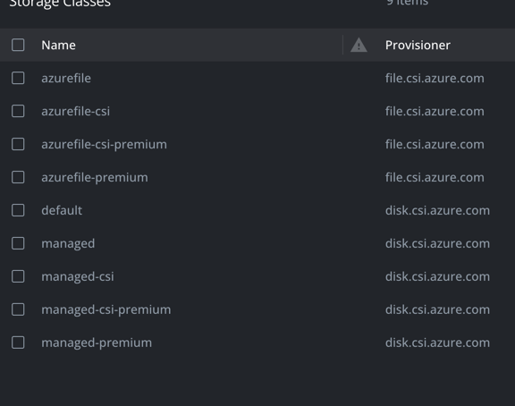

# AKS Disk Class Type
 
### 块存储
在 Azure Kubernetes Service (AKS) 中，`azurefile`、`azurefile-csi`、`azurefile-csi-premium` 和 `azurefile-premium` 这四个存储类的主要区别在于它们使用的存储类型和底层驱动器：

1. **`azurefile`**: 使用 Azure 文件存储（Standard 文件共享），通过 AKS 的内置存储驱动器。

2. **`azurefile-premium`**: 使用 Azure Premium 文件存储（Premium 文件共享），通过 AKS 的内置存储驱动器。

3. **`azurefile-csi`**: 使用 Azure 文件存储（Standard 文件共享），通过容器存储接口（Container Storage Interface, CSI）驱动器。CSI 驱动器提供了更多的功能和灵活性。

4. **`azurefile-csi-premium`**: 使用 Azure Premium 文件存储（Premium 文件共享），通过 CSI 驱动器。

`azurefile-csi` 和 `azurefile-csi-premium` 通过使用 CSI 驱动器，允许更现代化和标准化的存储集成方式，通常提供更好的性能和特性。
### 文件存储
在Azure Kubernetes Service (AKS) 中，`azurefile`、`azurefile-csi`、`azurefile-csi-premium` 和 `azurefile-premium` 这四个存储类的主要区别在于它们使用的存储类型和底层驱动器：

1. **`azurefile`**: 使用 Azure 文件存储（Standard 文件共享），通过 AKS 的内置存储驱动器。

2. **`azurefile-premium`**: 使用 Azure Premium 文件存储（Premium 文件共享），通过 AKS 的内置存储驱动器。

3. **`azurefile-csi`**: 使用 Azure 文件存储（Standard 文件共享），通过容器存储接口（Container Storage Interface, CSI）驱动器。CSI 驱动器提供了更多的功能和灵活性。

4. **`azurefile-csi-premium`**: 使用 Azure Premium 文件存储（Premium 文件共享），通过 CSI 驱动器。

`azurefile-csi` 和 `azurefile-csi-premium` 通过使用 CSI 驱动器，允许更现代化和标准化的存储集成方式，通常提供更好的性能和特性。
### 块存储 和 文件存储 区别
`managed` 类型存储类主要用于块存储（如磁盘）。  
`azurefile` 类型存储类用于文件共享。