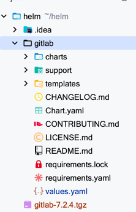
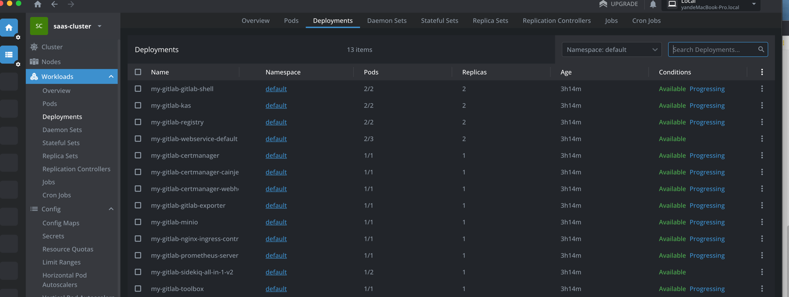
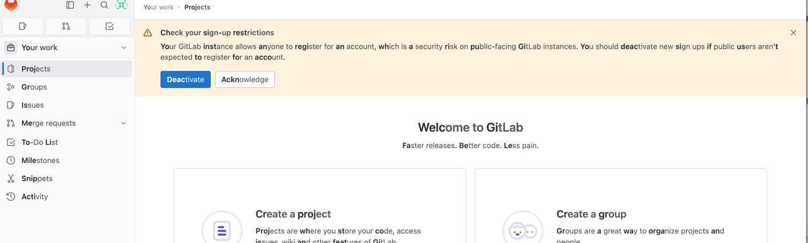

如何在Azure AKS 安装gitlab
---
## 前言
Azure是微软的云服务工具 本期我们将讨论用Azure 的K8s组件 AKS 搭建Gitlab-CE。在 Azure Kubernetes Service (AKS) 上安装 GitLab 可以通过以下步骤实现。
在这个过程中，我们将使用 Helm Chart 来部署 GitLab。
## 步骤
### 准备 Helm 客户端:  
  确保您已经安装了 Helm 客户端。如果没有安装，您可以按照 Helm 官方文档的指示进行安装：https://helm.sh/docs/intro/install/
### 添加 GitLab Helm 仓库：  
在 AKS 上创建一个新的命名空间，以便将 GitLab 部署隔离开来。您可以使用以下命令：
```
kubectl create namespace gitlab
```
然后添加 GitLab Helm 仓库 并安装Gitlab 到AKS
```
helm repo add gitlab http://charts.gitlab.io/
helm install gitlab gitlab/gitlab \
  --namespace gitlab \
```
如果我们要对GitLab的
配置做出修改，我们可以直接修改默认的value-gitlab.yml文件
修改后运行
```
helm install my-gitlab -f value-gitlab.yml   --namespace gitlab
```
### 自定义你的Charts
 如果我们要更进一步 修改Gitlab 的 某些依赖，比如CPU Redis 等， 那么需要进行如下操作
下载 Gitlab的Chart到本地
```
helm pull  gitlab/gitla
```
下载后的Chart是一个tar文件，解压后即可得到Chart仓库，如下图所示
  
此时我们对Gitlab以来的组件下的values.yaml进行修改即可，修改后，通过指令
```
helm install my-gitlab . 
```
其中点代表当下目录的chart，会自动的运行安装最后结果如下所示

