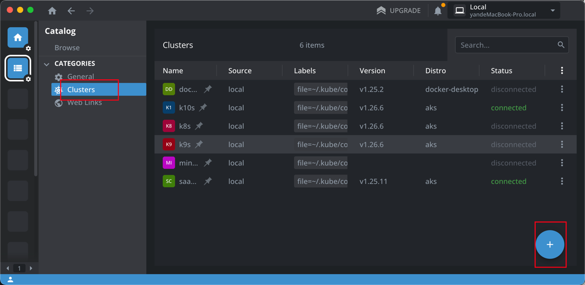
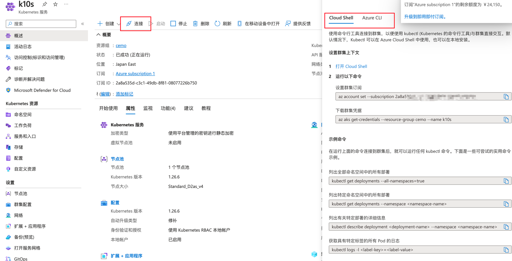
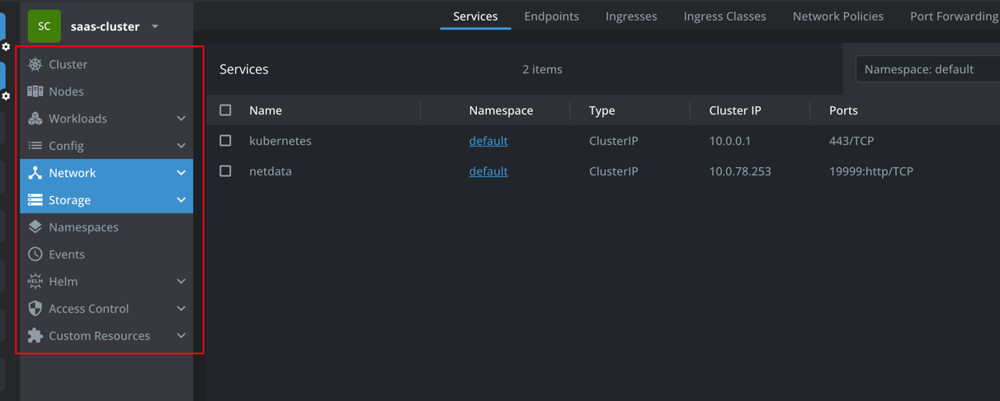
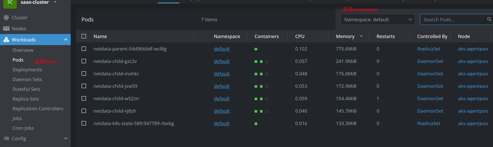
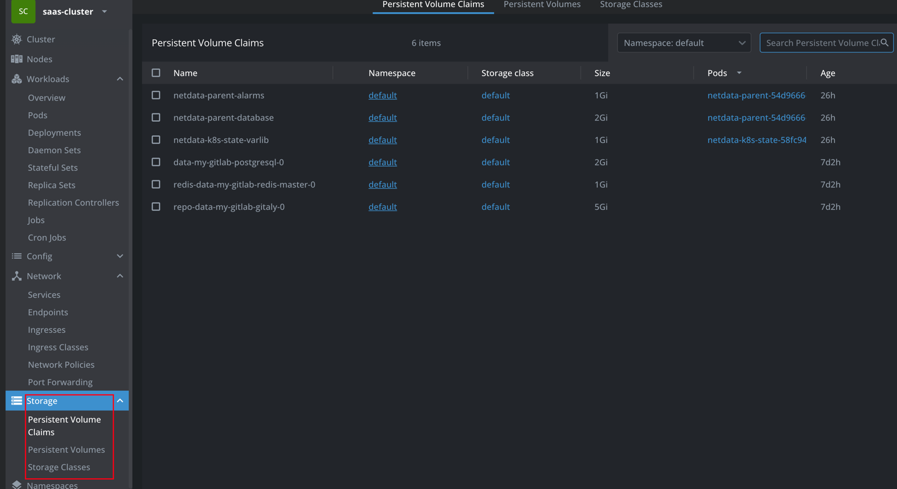
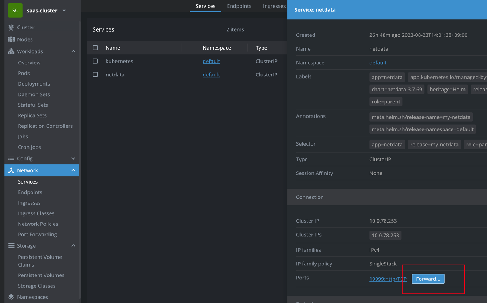
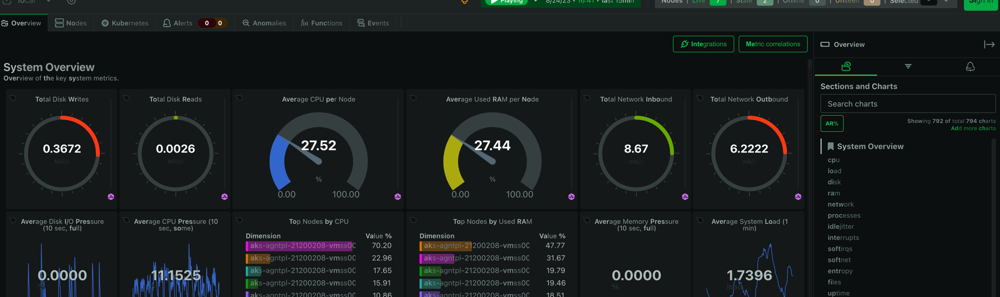

Lens的安装和使用
---
### 目录
- [前言](#前言)
- [Lens的安装](#Lens的安装)
- [Lens的使用](#Lens的使用)
- [总结](#总结)
### 前言
Lens（全称：Lens Kubernetes IDE）是一个用于管理和操作 Kubernetes 群集的跨平台开源工具。它提供了一个集成开发环境（IDE）来简化 Kubernetes 群集的管理、监控和操作，使开发人员和运维人员更轻松地与 Kubernetes 进行交互。
### Lens的安装
我们可以在其官网上[下载](https://k8slens.dev/)  
Lens现在已经开始收费但是只是商业版，个人版本可以免费使用，虽然缺少某些功能，但是不影响使用。
### Lens的使用
#### 导入K8sConfig
- 如果K8s的配置在本地，我们可以在界面上Cluster选项卡右下角的+号添加Cluster

- 如果是Azure或者AWS等，那么在其网页上应该有链接的方式，这里以Azure的AKS为例

#### Lens 查看K8s参数
链接上集群后我们就可以参看K8s参数了，通常的参数一般有如下图所示

这里需要我们有一定的K8s，此时如果我们需要查看POD的运行状态，可以查看Workloads下的Pods 选项

如果要查看存贮可以选择Storage选项

#### 通过Lens访问K8s中ClusterIp服务
如果我们安装好K8s后，但是由于Azure的局限性，一个K8s集群只能有三个External IP，所以如果当前安装的
Application没有External IP，那么我们可以通过在Network选项下的Service中点击App name

然后在弹出框中点击Start按钮

最后就可以访问相关App的网页

### 总结
Lens在查看K8s运行状态的时候非常方便，是开发和运维的方便的工具