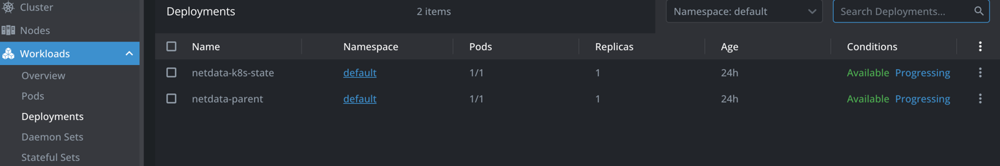
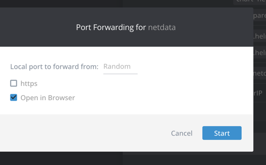
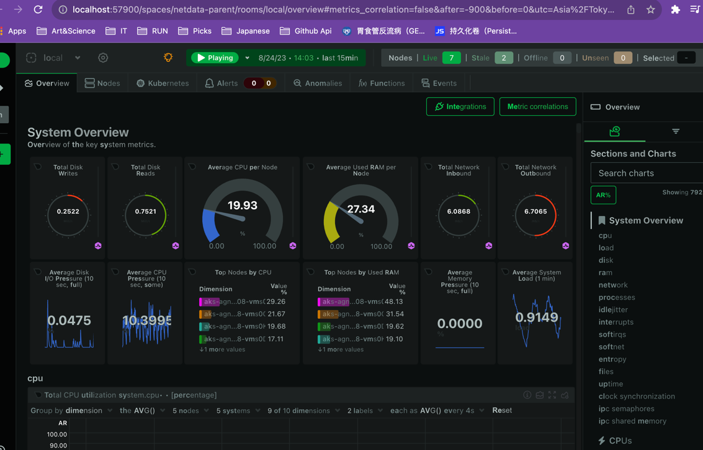
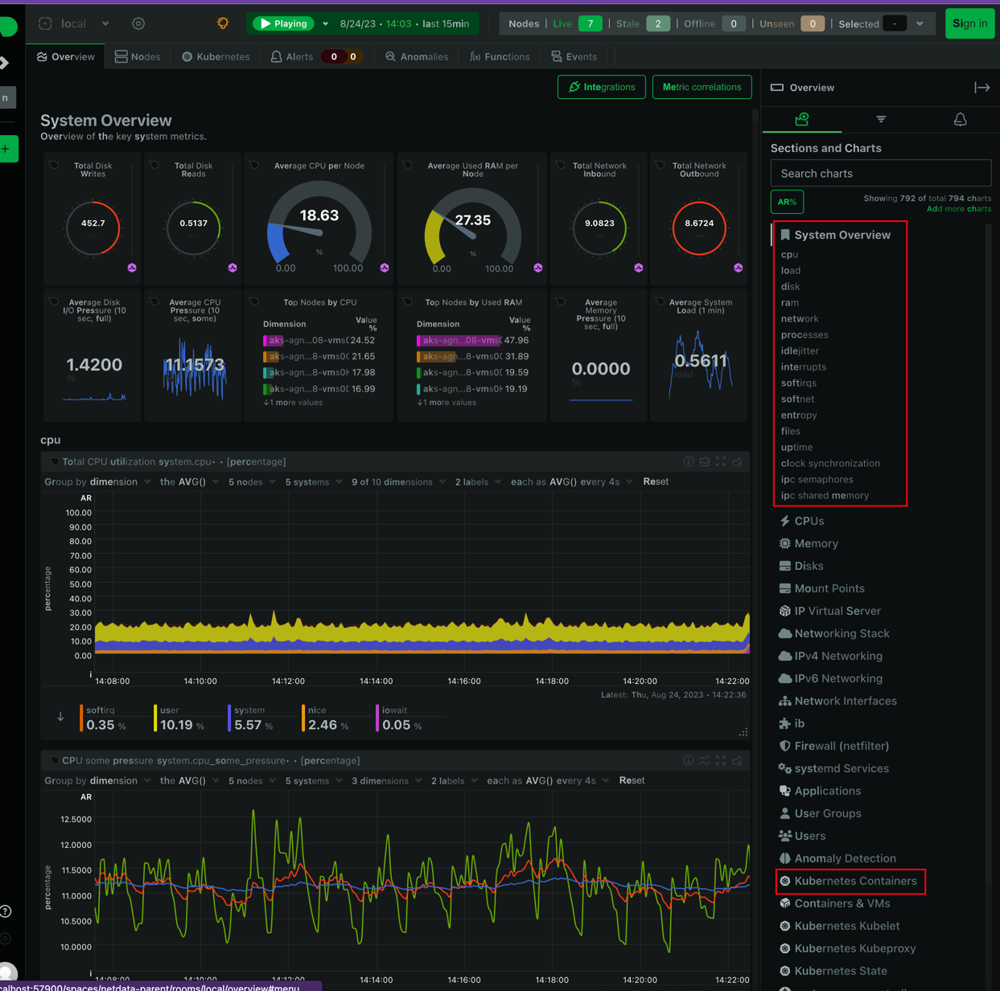
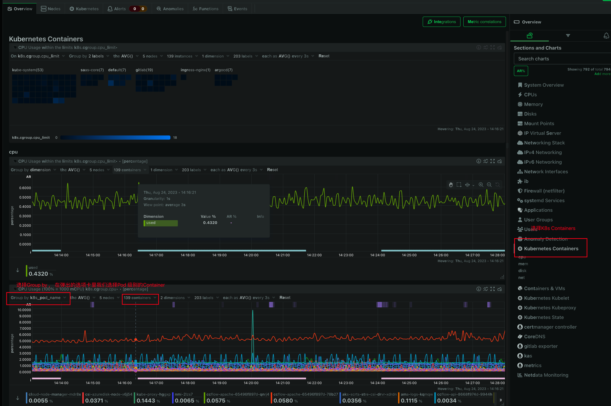
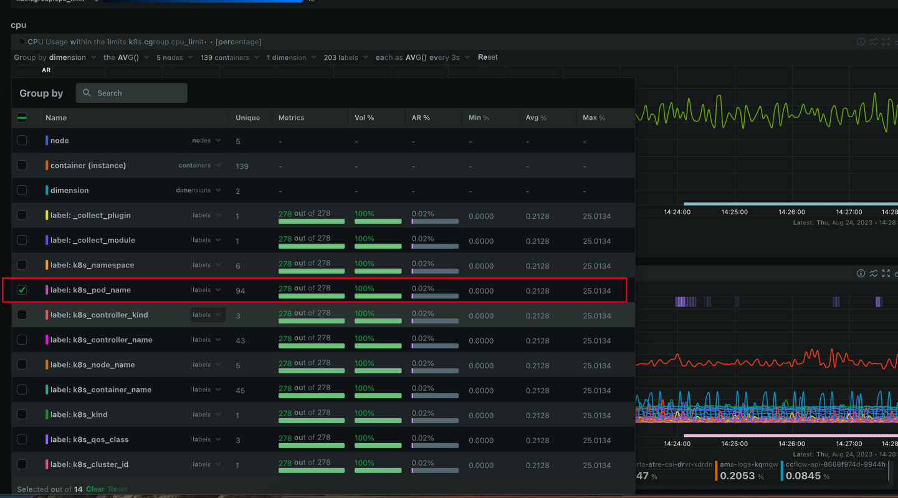
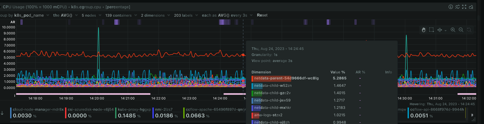

Netdata 的安装和使用
---
[Netdata](https://www.netdata.cloud/) 是一种用于实时性能监控和可视化的开源工具，基于[Prometheus](https://prometheus.io/)它可以用于监控服务器、
虚拟机和容器。它提供了丰富的图表和仪表板，可以帮助你实时了解系统的资源利用率、网络活动、磁盘活动等信息。  
接下来将介绍如何安装和使用
### 目录
- [Netdata安装](#Netdata安装)
- [Netdata的访问](#Netdata的访问)
- [NetData的使用](#NetData的使用)
- [总结](#总结)

#### Netdata安装
首先我们假定你已经连接上了你的`K8s`集群并安装好了`Helm`。这时候使用Helm指令安装Netdata
```
下载netadata库
helm repo add netdata https://netdata.github.io/helmchart
安装netdata
helm install my-netdata netdata/netdata --version 3.7.69
```
如果要自定义设置的话可以参考这篇文章 ([Helm使用自定义Chart模板来部署k8s应用](https://www.boysec.cn/boy/f6e04248.html)) 
对`Netdata`进行自定义。  
我们通过查看`Lens`的Deployments来查看是否安装好

#### Netdata的访问
安装好 `Netdata` 之后如果没有设置IP访问（`LoadBalancer`）此我们可以使用Lens的跳转功能
（类似反向代理） 如下图所示

在弹出的窗口中选择Start

会重新随机使用端口从本地访问Netdata


#### NetData的使用
NetData的功能很强的不仅支持K8s还支持很多的工具比如 `Redis` `PostgreSQL`,详情可以参照
Netdata的官网[Link](https://www.netdata.cloud/)。 由于篇幅有限，我们主要讲如何使用
Netdata监控K8s  
进入Netdata主页后我们可以看到如下画面

##### 查看POD级别的基本参数
右边侧边栏是监控的数据类别，我们可以说看到一些数据比如`SystemOverview`和CPUs等等，
这些都是监控数据，它对K8s的监测大部分都是Node基本的，如果我们想看Pod级别的话   
比如我们想看CPU使用率
可以如图操作

在弹出的选项卡中，如下图所示，有不同的标签，比如`namespace`、`node_name`、`pod_name`，这里我们选则pod_name

点击确认后 会显示所有node的CPU占用率

##### 查看单个POD的参数
紧接着上面的操作，我们在线式所有POD的CPU占有率之后，如果我们想查看单个POD的CPU占用率，那么需要选择指定的Container，如下图所示


### 总结
在上面的过程中我们主要介绍了Netdata的安装使用，产看单个POD参数的使用，如果想查看其他的参数可以参考
Netdata的[官方文档](https://learn.netdata.cloud/docs/architecture/distributed-data-architecture)
还有Netdata的[LiveDemo](https://app.netdata.cloud/spaces/netdata-demo/rooms/all-nodes/overview?utm_source=website&utm_content=top_navigation_demo&_gl=1*1qvdjee*_ga*NjA0OTE3NDUxLjE2OTIyNjMwOTU.*_ga_J69Z2JCTFB*MTY5MjMxOTQxNi4zLjEuMTY5MjMxOTYxOS41OS4wLjA.#metrics_correlation=false&after=-900&before=0&utc=Asia%2FTokyo&offset=%2B9&timezoneName=Osaka%2C%20Sapporo%2C%20Tokyo&modal=&modalTab=&modalParams=&selectedIntegrationCategory=deploy.operating-systems&d8a4e0c5-7c79-4145-900e-83a9f06fcb6a--chartName=menu_system)
