TiDB検証検証報告書
===========================
# 目次
- [TiDB検証概要](#TiDB検証概要)
- [TiDB検証環境準備](#TiDB検証環境準備)
- [TiDB検証テストデータ準備](#TiDB検証テストデータ準備)
- [TiDBセッキュリティ検証](#TiDBセッキュリティ検証)
- [TiDB性能検証](#TiDB性能検証)
- [DX環境でのTiDBインストール](#DX環境でのTiDBインストール)
## TiDB検証概要 
TiDB検証の詳細は下表のように纏めました。結論としては、TiDBはAzureクラウドで運用しやく、大量データを扱う場合でも性能に満足できる製品になります。
| NO | 検証内容 | 評価結果 | 備考 |
| ---------- | -----------|-----------|-----------|
| 1| TiDBのAzureクラウドインストール検証 | ◎ | Azureクラウドにインストールしたが、DX環境のインストールはまだ検証していない |
| 2| TiDBセッキュリティ運用検証 | ◎ |  |
| 2.1| Kubunetesバージョンアップ検証 | ◎ | DX基盤ではBlue/Green運用と称する |
| 2.2| データベースバックアップ検証 | ◎ |  |
| 2.3| TiDBバージョンアップ | ◎ |  |
| 2.4| データ保存テスク拡張検証 | ◎ |  |
| 2.5| 安全なDBアクセス方式の確立 | 〇 | サービスプリンシパル方式なし |
| 2.6| 多DBインスタンスの検証 | ◎ | インスタンス毎に細かくリリース振り分けできることを検証する |
| 3| TiDB性能検証 | 〇 | OrderBy対応に懸念が残ったため、一重まるを付けることに |

## TiDB検証環境準備

DX環境に検証する前にAzureのインターネット環境にTiDBをインストールし、性能とセッキュリテイ関連の検証を行った。インストール詳細は以下になります。

* Kubernetes　version： 1.25.11
※Blue/Greenプロセスを検証するためにインストール時に低いバージョンを選んだ
以下６Poolをインストール
* Tidb 2Pod
* Tikv 3Pod 各Pod１Ti　SSDテスクを付ける
* Pd    3Pod 
* Ticdc 3Pod
* Tiflash 3Pod
* Admin 1Pod


## TiDB検証テストデータ準備

### テストアプリ
CCFlowのワークフローシステム（SSFlow）のデータベースがSQL　ServerからTiDBに切り替え、テストアプリとして利用する
CCFlowエンジンなどを解析し、データベーステーブルにワークフローデータをインサートしてワークフローの承認関連動作や一覧などを正常に行えることを確認し、大容量テストデータの作成に入る。

### テストデータ
大容量テストデータ作成用のPythonプログラムを開発し、TiDBのAKS内テストデータ作成用POD（8Core,メモリ16Gi）、PODにテストデータ保存用ディスク１Tを付けることに、TiDB Lightningツールを使って1.5億件フロー（3業務フローにそれぞれ5000万件）データを導入した。
以上の1.5億件フローデータの容量は500Gi超になり、TiDBのセッキュリテイ性能を検証するためTiDB全体のボリュームが１Tiの状態でテストしたいと考えて、TiDBに新しいインスタンスを追加し、上記同じ500Giテストデータが新インスタンスにも導入した。

## TiDBセッキュリティ検証
以下の順でKubunetesバージョンアップ、データベースバックアップ、 TiDBバージョンアップ、データ保存テスク拡張、安全なDBアクセス方式の確立、多DBインスタンスの検証を行いました。

### Kubunetesバージョンアップ
KubunetesバージョンアップはよくBlue/Green運用の形で対応していますが、TiDBでは順次にSlave NodeのKubenetesのバージョンアップ完了し、最後Master NodeのKubenetesのバージョンアップを行う形で作業を進めます。下記のダイナミック図のようにPOD別のKubenetesバージョンアップのプロセスより対応することとしています。
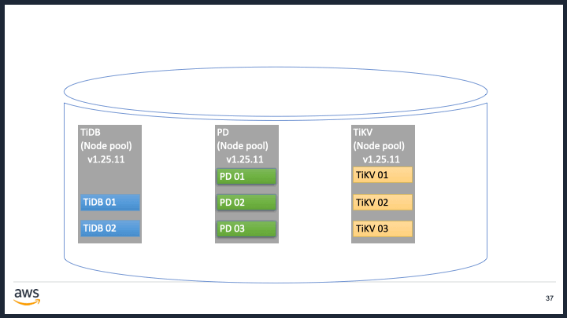  

検証詳細プロセスは以下のようになります。

* Node、Podの現状を確認します。

```
kubectl get nodes
```
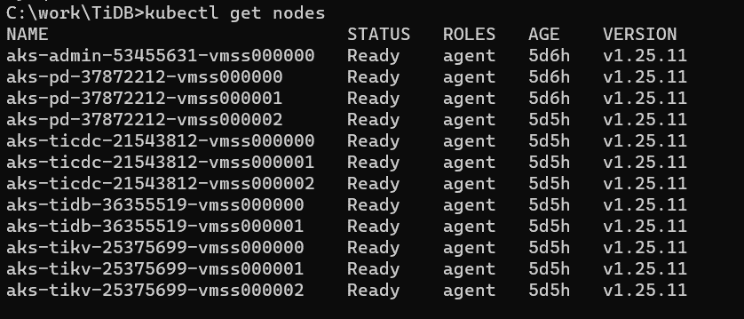  
```
kubectl get tc -n tidb-cluster
```
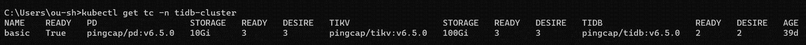  
```
kubectl get pod -n tidb-cluster -o wide
```
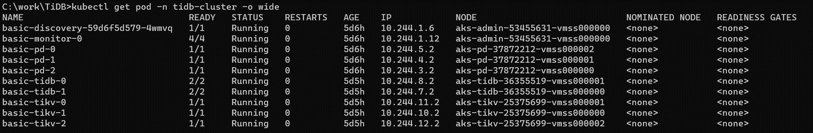  

* control plane、PoolのK8Sバージョンを確認します。

```
az aks show --resource-group saas-core --name aeontidb --output table
```
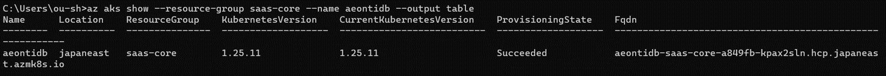  
```
az aks nodepool list --resource-group saas-core --cluster-name aeontidb --query "[].{Name:name,k8version:orchestratorVersion}" --output table
```
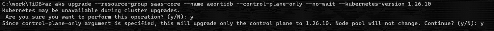  

* control planeのK8Sバージョンアップを行います。
※バージョン1.25.11は1.26.10など限定バージョンにしかバージョンアップできないようになっていて、ほかのバージョン番号を指定されたら、エラーが発生します。
```
az aks upgrade --resource-group saas-core --name aeontidb --control-plane-only --no-wait --kubernetes-version 1.26.10
```
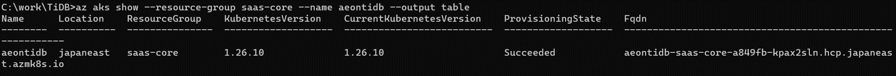  

```
az aks show --resource-group saas-core --name aeontidb --output table
```
  

* 新しいtidb Poolを新規作成します。
```
az aks nodepool add --name newtidb --cluster-name aeontidb --resource-group saas-core --node-vm-size Standard_E8s_v4 --zones 1 2 3 --node-count 2 --labels dedicated=tidb --node-taints dedicated=tidb:NoSchedule
```
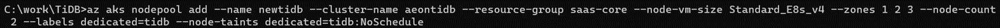  
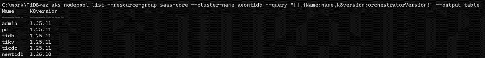  
* PODを確認します。
```
kubectl get pod -n tidb-cluster -o wide
```
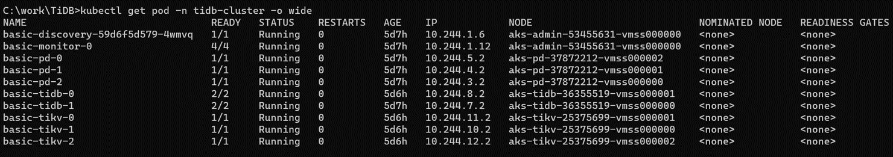 

* 古いtidb Poolの紐づけを外します。
```
az aks nodepool update --resource-group saas-core --cluster-name aeontidb --name "tidb" --labels="" --node-taints=""
```
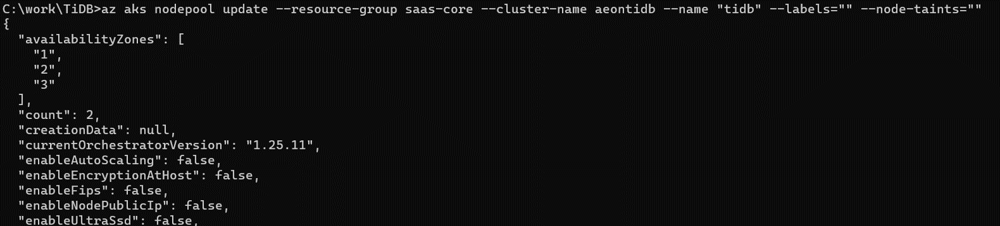 

* tidbのPodを削除します（新Tidb Poolに紐づける新しいPODを自動起動する）。
```
kubectl delete pod basic-tidb-0 -n tidb-cluster
kubectl delete pod basic-tidb-1 -n tidb-cluster
```
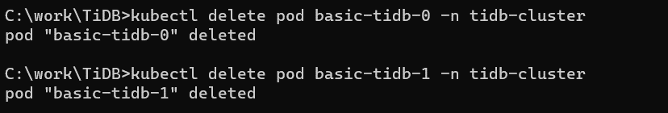 
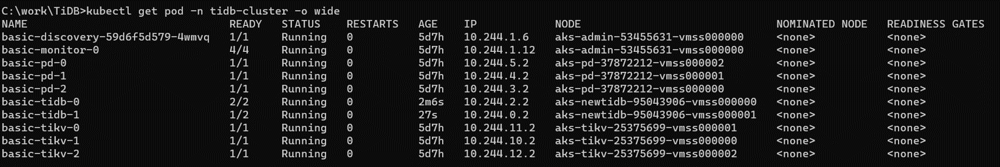
* 古いtidb Poolを削除します。
```
az aks nodepool delete --name tidb --cluster-name aeontidb --resource-group saas-core
```
 
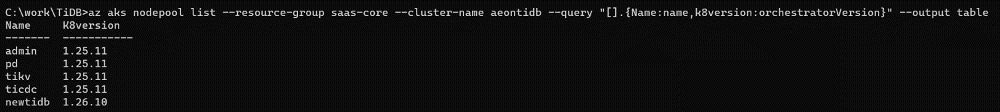

* Pd,tikvも同じように新規Pool,旧pool関連外し、POD削除などを行います、コマンドは以下になります。
```
az aks nodepool add --name newpd --cluster-name aeontidb --resource-group saas-core --node-vm-size Standard_F4s_v2 --zones 1 2 3 --node-count 3 --labels dedicated=pd --node-taints dedicated=pd:NoSchedule

az aks nodepool add --name newtikv --cluster-name aeontidb --resource-group saas-core --node-vm-size Standard_E8s_v4 --zones 1 2 3 --node-count 3 --labels dedicated=tikv --node-taints dedicated=tikv:NoSchedule

 az aks nodepool update --resource-group saas-core --cluster-name aeontidb --name "pd" --labels="" --node-taints=""
 az aks nodepool update --resource-group saas-core --cluster-name aeontidb --name "tikv" --labels="" --node-taints="“
kubectl delete pod basic-pd-0 -n tidb-cluster
kubectl delete pod basic-pd-1 -n tidb-cluster
kubectl delete pod basic-pd-2 -n tidb-cluster
kubectl delete pod basic-tikv-0 -n tidb-cluster
kubectl delete pod basic-tikv-1 -n tidb-cluster
kubectl delete pod basic-tikv-2 -n tidb-cluster
az aks nodepool delete --name pd --cluster-name aeontidb --resource-group saas-core
az aks nodepool delete --name tikv --cluster-name aeontidb --resource-group saas-core
```
* 新ticdc Poolを作成し、旧ticdc Poolを削除します。
```
az aks nodepool add --name newticdc --cluster-name aeontidb --resource-group saas-core --node-vm-size Standard_E16s_v4 --zones 1 2 3  --node-count 3 --labels dedicated=ticdc --node-taints dedicated=ticdc:NoSchedule
az aks nodepool delete --name ticdc --cluster-name aeontidb --resource-group saas-core
az aks nodepool list --cluster-name aeontidb --resource-group saas-core --output table
```
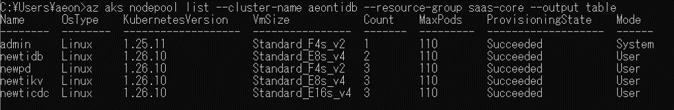 

* Master PoolのKubenetesバージョンアップを行います。
```
az aks nodepool upgrade --resource-group saas-core --cluster-name aeontidb --name admin --no-wait --kubernetes-version 1.26.10
```
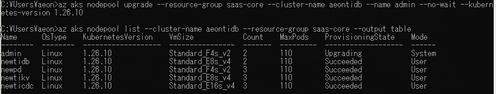 

* テストアプリ画面でフローの承認などの作業をし、正常に動作できることが確認できました！
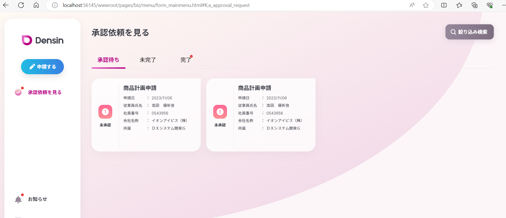 

### TiDBバージョンアップ
#### バージョンアップ前の確認
* TiDBサービス確認
```
kubectl get service -n tidb-cluster
```
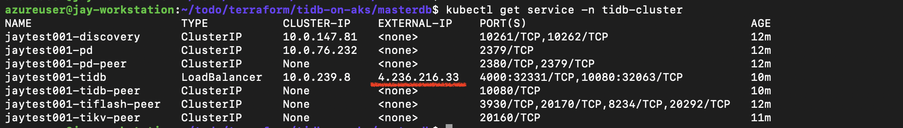

* バージョン確認
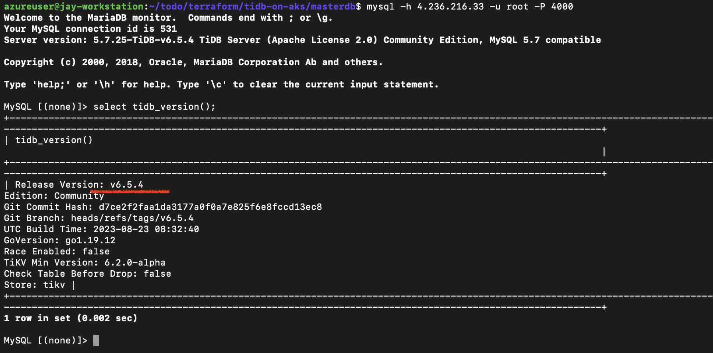
#### バージョンアップ実施

* バージョン設定
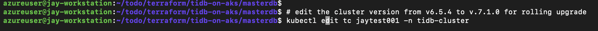
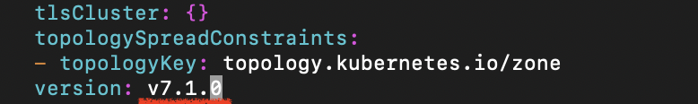

* バージョンアップ監視


#### バージョンアップ後の確認
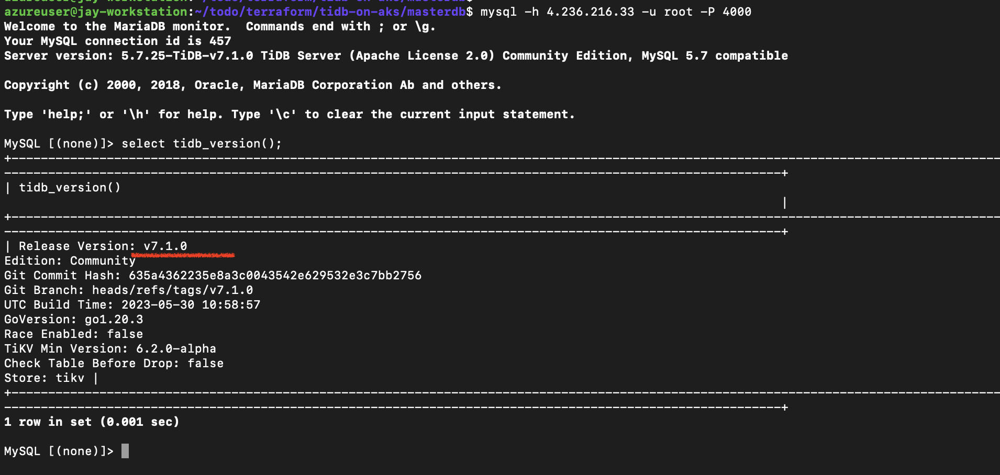

## TiDB性能検証 
### 性能検証概要
TiDB検証テストデータ準備(#TiDB検証テストデータ準備)の節にも紹介したように三つのワークフローにそれぞれ5000万件のフローテストデータを作成しました。以下の各テーブルのデータボリューム詳細情報です。
| NO | テーブル | データ件数 | 備考 |
| ---------- | -----------|-----------|-----------|
| 1| tt_wf_merchandise_plan | 5000万 | 仕入計画申請フローのトランザクションテーブル |
| 2| nd1track | 5000万 | 仕入計画申請フローのトラックテーブル |
| 3| tt_wf_arrival_returns | 5000万 | 入荷返品申請フローのトランザクションテーブル |
| 4| nd5track | 5000万 | 入荷返品申請フローのトラックテーブル |
| 5| tt_wf_stock_adjustment | 5000万 | 在庫調整申請フローのトランザクションテーブル |
| 6| nd7track | 5000万 | 在庫調整申請フローのトラックテーブル |
| 7| wf_generworkflow | 15000万 | ワークフローの申請状態情報管理テーブル |
| 8| wf_generworkerlist | 30000万 | ワークフロー状態変更履歴管理テーブル |
| 9| tt_wf_order_number | 15000万 | 業務申請番号採番管理テーブル |

以下は単テーブルCount性能検証、複数テーブルCount性能検証、多テーブル一覧検索性能検証、フロー新規（Insert）性能検証、フロー承認（Update）性能検証の順で性能検証を行う

### 単テーブルCount性能検証

### 複数テーブルCount性能検証


### 多テーブル一覧検索性能検証

以下のテストアプリ側に最もアクセスする画面ーー承認待ち/未完了/完了一覧画面<br/>
※以下はテストデータを表示されている画面イメージです。三画面データが同じタイミングでデータ抽出を行う
* 承認待ち一覧
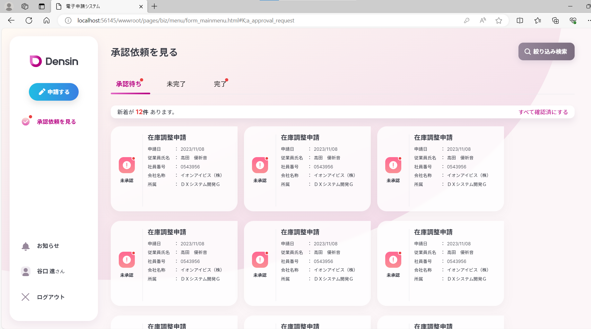 
* 完了一覧
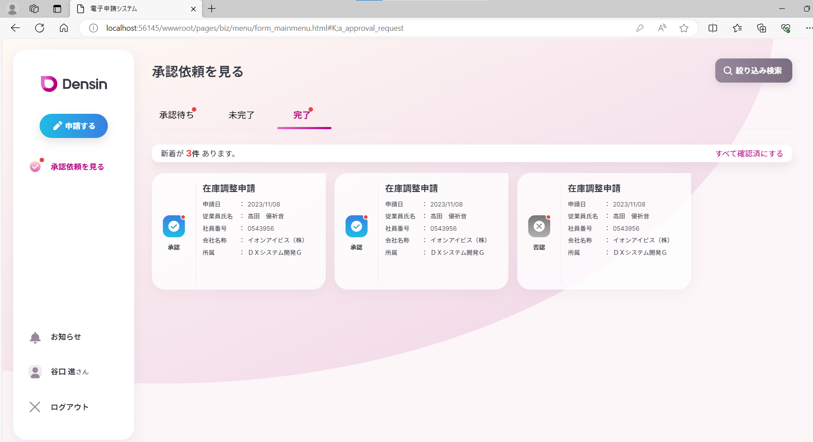 

### フロー新規（Insert）性能検証

### フロー承認（Update）性能検証

### TiDB導入後のデータ検索チューニングについて

