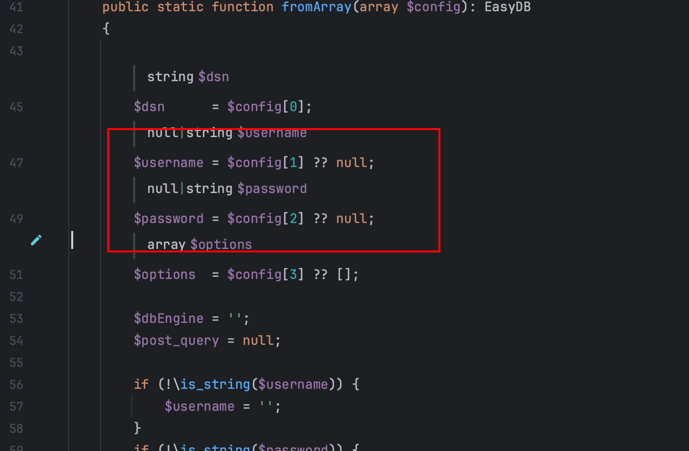

Tuleap インストール
===========================

#### 1. MySQL インストール
```shell
# 1. MySQL インストール
sudo dnf install mysql-server

# 2.
sudo systemctl start mysqld.service

# 3. MySQL の状態を確認
sudo systemctl status mysqld

# 4.  MySQL の設定
sudo mysql_secure_installation

# パスワードを設定する際に、「1 = MEDIUM」を選択してください
# インストールが完了したら、次のコマンドでログインできるか確認してください
mysql -u root -p

# Tuleap の設定
# 设置 [mysqld]\nsql-mode="NO_ENGINE_SUBSTITUTION" 到 /etc/my.cnf.d/tuleap.cnf
sudo /etc/my.cnf.d/tuleap.cnf

# 再起動
sudo systemctl restart mysqld
```
#### 2.Redisインストール
```shell
# Redis のインストール
sudo dnf install redis
# 2 Redis パスワードの設定
redis-cli
CONFIG set requirepass yourpassword
```
#### 3.安装Tuleap (Step by step Installation)
[参考链接](https://docs.tuleap.org/installation-guide/step-by-step/introduction.html)
```shell
# EPEL のインストール
sudo dnf install https://dl.fedoraproject.org/pub/epel/epel-release-latest-9.noarch.rpm

# Remi リポジトリのインストール（最新の PHP バージョンが必要です）
sudo dnf install https://rpms.remirepo.net/enterprise/remi-release-9.rpm

# Tuleap リポジトリのインストール
sudo dnf install https://ci.tuleap.net/yum/tuleap/rhel/9/dev/x86_64/tuleap-community-release.rpm

# Tuleap のインストール
sudo dnf install -y \
  mysql-server \
  tuleap \
  tuleap-theme-burningparrot \
  tuleap-theme-flamingparrot \
  tuleap-plugin-agiledashboard \
  tuleap-plugin-graphontrackers \
  tuleap-plugin-git \
  tuleap-plugin-hudson-git \
  tuleap-plugin-pullrequest \
  tuleap-plugin-gitlfs \
  tuleap-plugin-document \
  tuleap-plugin-onlyoffice \
  tuleap-plugin-embed \
  tuleap-plugin-gitlab \
  tuleap-plugin-openidconnectclient \
  tuleap-plugin-ldap
```
#### 4.Tuleap の設定と起動
```shell
# プログラム内のユーザー名とパスワードを変更
sudo vim /usr/share/tuleap/src/vendor/paragonie/easydb/src/Factory.php
```
データベースのユーザー名とパスワードに変更します

```shell

# 起動
sudo /usr/share/tuleap/tools/setup.sh -d \
   --configure \
   --server-name=localhost \
   --mysql-user=root \
   --mysql-server=localhost \
   --mysql-password=5545125@Pp- \
   --reinstall
```
最後に、ローカルで localhost にアクセスして接続できるか確認してください。